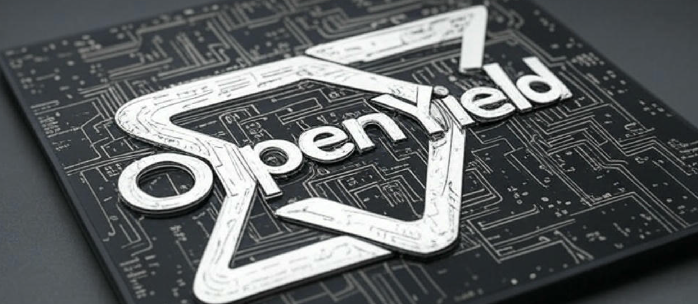

# OpenYield

This project is a open-source yield analysis for SRAM circuits.

> OpenYield is under development, some definitions of functions and classes may change significantely.

## Supported PDK
In this initial version, we only support FreePDK45. The model file is located in ` model_lib/models.spice `.

## Base Component
### SRAM 6T Cell
The 6T cell class defined in ` sram_6t_core.py ` can be tested individually. It can be configured with (without) pi-shaped RC networks.
### SRAM Array
The 6T SRAM core array is defined in ` sram_6t_core.py `. It consists of rowxcolumn 6T cells.
### SRAM Array Testbench
The testbench for SRAM array is located in ` sram_6t_core_testbench.py `. It supports NgSpice to run norminal simulaiton and HSPICE to run MC sweeps. It contains read and write operations in this version.

### Utils
The ` utils.py ` contains plot function, measurement function, and SNM calulation functions.

## Run command
If you want to run 6T cell simulation, please see the main function in [`sram_6t_core_testbench.py`](sram_6t_core_testbench.py)
``` bash
python sram_6t_core_testbench.py
```
Some simulation results are in `sim/` and plots are in `plots/`.

## TODO
A ton of works need to be done, including
1. Sense amplifiers
2. Column multiplexers
3. WL drivers
4. Prechargers
5. Write drivers
6. Decoder
7. DFFs
8. Other types of SRAM cell (8T, 9T, 10T)
9. Timing controller
10. SNM simulation (to ensure hold ability)
11. Size optimization
12. Yield analysis