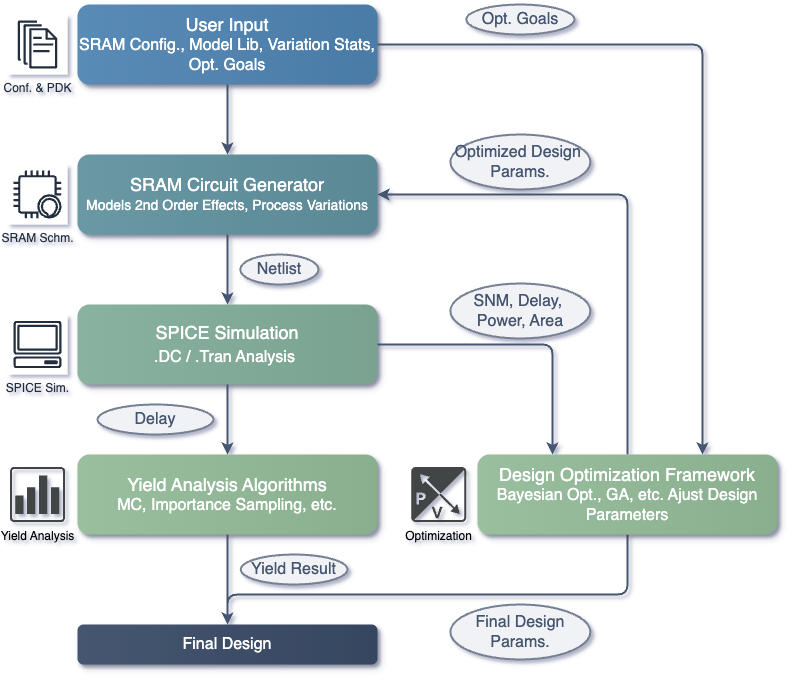

# OpenYield: An Open-Source SRAM Yield Analysis and Optimization Benchmark Suite

**OpenYield** is a novel and scalable SRAM circuit generator designed to produce diverse, industrially-relevant test cases. It distinguishes itself by incorporating critical second-order effects often overlooked in simpler SRAM models, such as:

* **Detailed Parasitics:** Accurate modeling of parasitic capacitances and resistances.
* **Inter-cell Leakage Coupling:** Accounting for leakage current interactions between adjacent memory cells.
* **Peripheral Circuit Variations:** Modeling variations in the behavior of peripheral circuits like sense amplifiers and write drivers.

This enhanced level of detail enables more realistic and reliable yield analysis of SRAM designs.

## Key Features

* **Xyce Integration:** Utilizes the Xyce parallel circuit simulator for transistor-level simulations.
* **Monte Carlo Simulation Support:**
    * Built-in Monte Carlo simulations within Xyce.
    * Support for user-defined Monte Carlo simulations, allowing for custom process parameter generation.
* **SRAM Cell Types:** Supports 6T and 10T SRAM cells.
* **Equivalent Circuit Modeling:** Fast approximate equivalent circuits for unused SRAM cells (5-capacitor parasitic model: `c_bl`, `c_blb`, `c_wl`, `c_wl_bl`, `c_wl_blb`) to speed up large-array simulation.
* **Performance Metrics Analysis:** Evaluates critical SRAM performance metrics:
    * Hold / Read / Write Static Noise Margin (SNM)
    * Read and Write Delay
    * Static and Dynamic Power
* **SRAM Sizing Optimization:** Integrated two-stage optimization for transistor sizing and architecture configuration.
* **Output Parsing and Waveform Plotting:** Includes parsers to extract simulation results and tools to visualize signal waveforms.



## Dependencies

* **[FreePDK45](https://eda.ncsu.edu/freepdk/freepdk45/):** Required by SRAM circuit generator and Xyce simulator.

* **[PySpice](https://pyspice.fabrice-salvaire.fr/releases/v1.4/overview.html):** Required by SRAM circuit generator:

    ```bash
    pip install PySpice
    ```

* **[Xyce](https://xyce.sandia.gov/about-xyce/):** A SPICE simulator for fast simulation. Install using conda through vlsida channel (built for [OpenRAM](https://github.com/VLSIDA/OpenRAM.git)):

    ```bash
    conda install -q -y -c vlsida-eda trilinos
    conda install -q -y -c vlsida-eda xyce
    ```
    For building your own Xyce please refer to this [guide](https://xyce.sandia.gov/documentation-tutorials/building-guide/)

* **Python packages for optimization** (install via pip):

    ```bash
    pip install numpy scipy matplotlib pandas torch botorch gpytorch smac
    ```

## Usage Examples

### 0. Conda Environment Creation

Create the conda environment from the `yml` file:
```bash
conda env create -f environment.yml
conda activate openyield
```

Or update an existing environment:
```bash
conda env update -f environment.yml
```

### 1. SRAM Circuit Generator

The generation modules of each sub-circuit are located in `sram_compiler/subcircuits/`.

The simulation code is in `sram_compiler/testbenches/`.

Circuit and simulation parameters are configured through YAML files in `sram_compiler/config_yaml/`.

The main simulation entry point is `main_sram.py`.

#### Configuration via YAML

Key parameters in `sram_compiler/config_yaml/global.yaml`:
```yaml
vdd: 1.0            # Supply voltage (V)
temperature: 27     # Temperature (Celsius)
num_rows: 16        # Number of SRAM rows
num_cols: 16        # Number of SRAM columns
monte_carlo_runs: 2 # Monte Carlo simulation runs
corner: TT          # Process corner (TT/FF/SS/FS/SF)
```

Transistor widths and models for each cell type are in:
- `sram_compiler/config_yaml/sram_6t_cell.yaml`
- `sram_compiler/config_yaml/sram_10t_cell.yaml`
- `sram_compiler/config_yaml/precharge.yaml`, `wordline_driver.yaml`, etc.

#### Running a Simulation

```bash
python main_sram.py
```

Or programmatically:
```python
from sram_compiler.testbenches.sram_6t_core_MC_testbench import Sram6TCoreMcTestbench
from config import SRAM_CONFIG
from PySpice.Unit import u_Ohm, u_pF

sram_config = SRAM_CONFIG()
sram_config.load_all_configs(
    global_file="sram_compiler/config_yaml/global.yaml",
    circuit_configs={
        "SRAM_6T_CELL": "sram_compiler/config_yaml/sram_6t_cell.yaml",
        "WORDLINEDRIVER": "sram_compiler/config_yaml/wordline_driver.yaml",
        "PRECHARGE": "sram_compiler/config_yaml/precharge.yaml",
        "COLUMNMUX": "sram_compiler/config_yaml/mux.yaml",
        "SENSEAMP": "sram_compiler/config_yaml/sa.yaml",
        "WRITEDRIVER": "sram_compiler/config_yaml/write_driver.yaml",
        "DECODER": "sram_compiler/config_yaml/decoder.yaml",
    }
)

mc_testbench = Sram6TCoreMcTestbench(
    sram_config,
    sram_cell_type="SRAM_6T_CELL",  # or "SRAM_10T_CELL"
    w_rc=True,
    pi_res=100 @ u_Ohm, pi_cap=0.001 @ u_pF,
    vth_std=0.05,
    mc=True,
    use_equivalent=True,  # use equivalent circuit for unused cells
    corner='TT',
    sim_path='sim/',
)

# Transient analysis: 'write', 'read', or 'read&write'
delay, pavg, pstc, pdyn = mc_testbench.run_mc_simulation(
    operation='write',
    target_row=15, target_col=15,
    mc_runs=10,
    temperature=27,
)

# DC analysis: 'write_snm', 'hold_snm', 'read_snm'
snm = mc_testbench.run_mc_simulation(
    operation='read_snm',
    target_row=15, target_col=15,
    mc_runs=10,
    temperature=27,
)
```

Simulation outputs (netlists, waveforms, results) are saved to the `sim_path` directory.

### 2. Equivalent Circuit Modeling

For large arrays, unused SRAM cells can be replaced with a compact 5-capacitor equivalent circuit to dramatically reduce simulation time.

Enable with `use_equivalent=True` when creating the testbench (shown above).

To analyze and characterize the equivalent model for different array sizes:

```bash
python equivalent_modeling/main_sram.py
```

This compares simulation results with and without the equivalent model across different array configurations. See [`equivalent_modeling/EQUIVALENT_CIRCUIT_ANALYSIS.md`](equivalent_modeling/EQUIVALENT_CIRCUIT_ANALYSIS.md) for a detailed explanation of the model.

### 3. SRAM Sizing Optimization

OpenYield includes a suite of optimization algorithms for SRAM transistor sizing and architecture configuration. All algorithms share a common interface via `size_optimization/exp_utils.py`.

#### Available Algorithms

| Algorithm | Script | Description |
|-----------|--------|-------------|
| SA | `demo_sa.py` | Simulated Annealing |
| PSO | `demo_pso.py` | Particle Swarm Optimization |
| CBO | `demo_cbo.py` | Constrained Bayesian Optimization |
| RoSE-Opt | `demo_roseopt.py` | Reinforcement Learning Enhanced BO |
| CMA-ES | `demo_cmaes.py` | Covariance Matrix Adaptation Evolution Strategy |
| SMAC | `demo_smac.py` | Sequential Model-based Algorithm Configuration |
| NSGA-II | `demo_nsgaii.py` | Multi-Objective Genetic Algorithm |
| MOEAD | `demo_moead.py` | Multi-Objective Evolutionary Algorithm based on Decomposition |
| MOBO | `demo_mobo.py` | Multi-Objective Bayesian Optimization |
| CPN | `demo_cpn.py` | TabPFN-based Bayesian Optimization (requires `tabpfn`) |
| tSS-BO | `demo_tssbo.py` | Truncated Subspace Sampling BO (requires separate tSS-BO repo) |
| Random | `demo_random.py` | Random Search (baseline) |

#### Running an Optimization

```bash
cd /path/to/OpenYield
python size_optimization/demo_sa.py        # Simulated Annealing
python size_optimization/demo_pso.py       # PSO
python size_optimization/demo_cbo.py       # Constrained BO
```

#### Two-Stage Optimization (Architecture + Sizing)

For joint architecture and transistor sizing optimization:

```bash
python size_optimization/experiment.py
```

This runs a two-stage flow:
1. Stage 1 (SMAC): Search over architecture configurations (rows, cols, arrays).
2. Stage 2: Optimize transistor sizing for the best architecture candidates.

#### Optimization Parameter Space

The parameter space is defined in `size_optimization/exp_utils.py`:
- **`ModifiedSRAMParameterSpace`**: 7-dimensional bitcell transistor sizing space.
- **`CompositeSRAMParameterSpace`**: 24-dimensional joint space (bitcell + peripheral circuits).

#### Multi-Seed Result Visualization

To plot convergence curves with standard deviation across multiple seeds, use the scripts in `size_optimization/guidance/`:

```bash
python size_optimization/guidance/plot_with_std.py
```

See [`size_optimization/guidance/README_multi_seed.md`](size_optimization/guidance/README_multi_seed.md) for detailed instructions.

### 4. SRAM Yield Estimation Algorithms

OpenYield provides integrated SRAM yield estimation algorithms based on Monte Carlo and advanced importance sampling techniques.

#### Available Algorithms
- **MC**: Monte Carlo
- **MNIS**: Mean-shifted Importance Sampling
- **ACS**: Adaptive Compressed Sampling
- **AIS**: Adaptive Importance Sampling
- **HSCS**: High-dimensional Sparse Compressed Sampling

## Project Structure

```
OpenYield/
├── main_sram.py                  # Main simulation entry point
├── config.py                     # Centralized YAML config loader
├── utils.py                      # Area estimation utilities
├── environment.yml               # Conda environment specification
├── sram_compiler/
│   ├── config_yaml/              # YAML configuration files for all circuits
│   ├── subcircuits/              # Circuit generation modules (6T, 10T, peripherals)
│   └── testbenches/              # Simulation testbench classes
├── size_optimization/
│   ├── exp_utils.py              # Shared optimization utilities and parameter spaces
│   ├── experiment.py             # Two-stage optimization driver
│   ├── demo_sa.py                # Simulated Annealing
│   ├── demo_pso.py               # Particle Swarm Optimization
│   ├── demo_cbo.py               # Constrained Bayesian Optimization
│   ├── demo_roseopt.py           # RoSE-Opt
│   ├── demo_cmaes.py             # CMA-ES
│   ├── demo_smac.py              # SMAC
│   ├── demo_nsgaii.py            # NSGA-II
│   ├── demo_moead.py             # MOEAD
│   ├── demo_mobo.py              # Multi-Objective BO
│   ├── demo_cpn.py               # CPN (TabPFN-based BO)
│   ├── demo_tssbo.py             # tSS-BO
│   ├── demo_random.py            # Random search baseline
│   ├── NSGA-II/                  # NSGA-II implementation
│   ├── MOBO/                     # MOBO implementation
│   ├── moead/                    # MOEAD implementation
│   └── guidance/                 # Multi-seed experiment scripts and plotting
├── equivalent_modeling/
│   ├── main_sram.py              # Equivalent circuit analysis script
│   └── EQUIVALENT_CIRCUIT_ANALYSIS.md
├── tran_models/                  # FreePDK45 transistor model files
└── yield_estimation/             # Yield estimation algorithms
```

## Important Notes

* Ensure Xyce is installed and available in your system PATH.
* All paths in the codebase are relative to the project root — the repository can be cloned and run from any location.
* FreePDK45 model files are included in `tran_models/`.
* Simulation output directories (`sim/`) are created automatically and are excluded from git.

## Contributing

Contributions to OpenYield are welcome! Please refer to the contribution guidelines for details on how to get involved.
