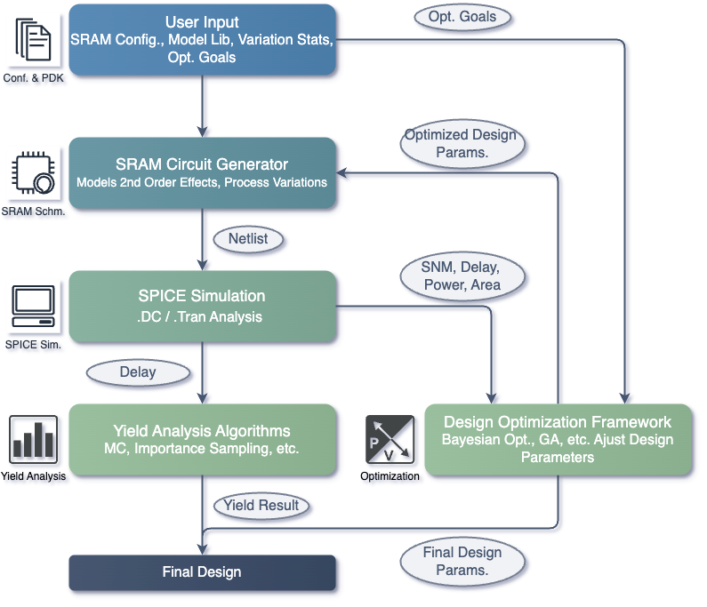

# OpenYield: An Open-Source SRAM Yield Analysis and Optimization Benchmark Suite

**OpenYield** is a novel and scalable SRAM circuit generator designed to produce diverse, industrially-relevant test cases. It distinguishes itself by incorporating critical second-order effects often overlooked in simpler SRAM models, such as:

* **Detailed Parasitics:** Accurate modeling of parasitic capacitances and resistances.
* **Inter-cell Leakage Coupling:** Accounting for leakage current interactions between adjacent memory cells.
* **Peripheral Circuit Variations:** Modeling variations in the behavior of peripheral circuits like sense amplifiers and write drivers.

This enhanced level of detail enables more realistic and reliable yield analysis of SRAM designs.

## Key Features

* **Xyce Integration:** Utilizes the Xyce parallel circuit simulator for transistor-level simulations.
* **Monte Carlo Simulation Support:**
    * Built-in Monte Carlo simulations within Xyce.
    * Support for user-defined Monte Carlo simulations, allowing for custom process parameter generation.
* **Performance Metrics Analysis:** Evaluates critical SRAM performance metrics:
    * Hold Static Noise Margin (SNM)
    * Read Static Noise Margin (SNM)
    * Write Static Noise Margin (SNM)
    * Read Delay
    * Write Delay
* **Output Parsing and Waveform Plotting:** Includes parsers to extract simulation results and tools to visualize signal waveforms.
* **Extensible Design:** The project is under active development with plans to integrate various yield analysis and sizing optimization algorithms.



## Dependencies
* **[FreePDK45](https://eda.ncsu.edu/freepdk/freepdk45/):** Required by SRAM circuit generator and Xyce simulator.

* **[PySpice](https://pyspice.fabrice-salvaire.fr/releases/v1.4/overview.html):** Required by SRAM circuit generator. Install using pip:

    ```bash
    pip install PySpice
    ```
    
* **[Xyce](https://xyce.sandia.gov/about-xyce/):** A SPICE simulator for fast simulation. Install using conda through vlsida channel (built for [OpenRAM](https://github.com/VLSIDA/OpenRAM.git)):

    ```bash
    conda install -q -y -c vlsida-eda trilinos
    conda install -q -y -c vlsida-eda xyce
    ```
    For building your own Xyce please refers to this [guide](https://xyce.sandia.gov/documentation-tutorials/building-guide/)

## Usage Examples
The `main.py` contains the usage examples.

### 0.  Conda Environment  Creation
create the conda environment from our `yml` file:
```bash
conda env create -f environment.yml
```
If you success, then activate the env
```bash
conda activate openyield
```
otherwise, check the environment and update it
```bash
conda env update -f environment.yml
```


### 1.  Using the `Testbench` Class
Define some PDK related parameters.
```python
vdd = 1.0 # Supply voltage
# your pdk_path is `'model_lib/models.spice'` by default 
pdk_path = 'model_lib/models.spice' 
# Mos model name for NMOS and PMOS
nmos_model_name = 'NMOS_VTG'
pmos_model_name = 'PMOS_VTG'
```

The `Sram6TCoreMcTestbench` class in `testbenches/sram_6t_core_MC_testbench.py` facilitates Monte Carlo simulations of the SRAM core. Here's a basic example of how to instantiate and use it:

```python
from testbenches.sram_6t_core_MC_testbench import Sram6TCoreMcTestbench

# Create an instance of the testbench
mc_testbench = Sram6TCoreMcTestbench(
    vdd,
    pdk_path, nmos_model_name, pmos_model_name,
    num_rows=num_rows, num_cols=num_cols, 
    w_rc=True, # Add RC to nets
)
```

### 2. Using the `run_mc_simulation` Method
The `run_mc_simulation` method within the `SRAM_6T_Array_MC_Testbench` class executes Monte Carlo simulations.  Here's an example demonstrating its usage:

```python 
# Continue with instantiation of Sram6TCoreMcTestbench
# Define the number of Monte Carlo samples
num_samples = 10

# Run the Monte Carlo simulation
# For using DC analysis, operation can be 'write_snm' 'hold_snm' 'read_snm'
read_snm = mc_testbench.run_mc_simulation(
    operation='write_snm', 
    target_row=num_rows-1, target_col=num_cols-1, 
    mc_runs=num_mc, vars=None, # Input your data table
)

# For using TRAN analysis, operation can be 'write' or 'read'
w_delay, w_pavg = mc_testbench.run_mc_simulation(
    operation='write', 
    target_row=num_rows-1, target_col=num_cols-1, 
    mc_runs=num_mc, vars=None, # Input your data table
)
```

## Important Notes:

* Ensure that you have Xyce installed and configured correctly. OpenYield assumes Xyce is available in your system's PATH.
* The netlist parameter should point to the SPICE netlist file describing your SRAM cell.
* The structure of the mc_results will depend on the specific analyses performed in the Monte Carlo simulation. You'll need to inspect the output to understand how to access the desired metrics.
* Refer to main.py for more complete examples and usage patterns.

## Future Development
This project is actively being developed.  Planned future enhancements include:
* Integration of advanced yield analysis algorithms.
* Implementation of SRAM cell sizing optimization techniques.

## Contributing
Contributions to OpenYield are welcome! Please refer to the contribution guidelines for details on how to get involved.