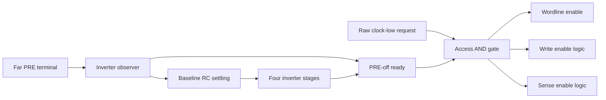

# V2.1.1 distributed-only signal wiring

All **eleven final-source waveform cases pass 33,096 checks**. The repaired
8x512 SS write passes 12,851 checks at 8 ns; the 64x64 TT sequence passes
11,209 checks at 5 ns; nine small cases pass 9,036 checks. Both large-array
release gates are complete, with the lookup clocks unchanged.

V2.1.1 includes distributed-only wiring, a physical precharge-off guard for
access assertion, and the retention/CLI repairs from the V2.1.0 follow-up. The V2.1.0
timing lookup, V2.0.9 driver classes and V2.0.5 qualification format retain
their original identities. Historical results are not relabeled.

The [star-RC screen](STAR_RC_SCREEN_V2_1_0.md) identified both the selectable
star topology and shared junctions remaining in distributed mode. The user's
subsequent instruction removes that topology and makes distributed wiring the
only implementation. The screen itself is preserved as a pre-change record.

## Configuration and removal

`InterconnectConfig()`, `resolve_interconnect(None)`, omitted YAML settings,
the main entrance, CLI and optimizer now resolve distributed wiring. Explicit
`mode: star` is rejected; it is not silently reinterpreted. The default matches
`interconnect_example.yaml`: 1 ohm and 0.1 fF per pitch, with 0.6 µm pitch and
0.1 µm wire width. These values are illustrative and are not foundry extraction.

The compiler no longer contains shared-node array/replica alternatives,
aggregate omitted-cell signal capacitances, the extra star replica row, or
the duplicate lumped RBL sensing branch. Dummy row/column factories also use
distributed taps. Unused top-level dummy insertion helpers and the unmatched
AND2 replica path were removed. Explicit unmatched or noncanonical diagnostics
are rejected by the sizing resolver.

`w_rc` remains the independent switch for local storage/peripheral **series**
RC. `cell_pin_rc` optionally adds series cell-pin sections and defaults to
false, including direct cell constructors. Disabling local stubs leaves all
physical signal-wire ladders present. Supply leakage aggregation is retained;
it is not a signal-wire RC topology.

## Closing the screen's A–E junctions

| Screen item | Current implementation | Geometry assumption |
|---|---|---|
| A: BL/BLB periphery | Three-pitch ladder from each array port; distinct precharge, write and mux/sense taps | Reuse bitline geometry; taps at 0.5, 1.5 and 2.5 pitches, far endpoint at 3 pitches |
| B: replica periphery | Same BL/BLB ladder and peripheral load order as the array | Same three pitches; TIME observes actual replica sense input |
| C: decoder fan-out | Per-bit address trunks plus true/complement/enable ladders in each 3-to-8 block | Trunks span row height; each level partitions that height among its blocks; eight outputs span each block, including unused gates |
| D: write-data clock | DATA_DFF clock pi ladder, one centered tap per column | Wordline pitch across column count |
| E: mux selects | Separate SEL ladders with each group at its own column tap | Wordline pitch across column count |

Decoder predecode outputs feed downstream block enable ladders. Existing
gate logic and binary address polarity are retained, including non-power-of-two
row counts. Address registers remain clustered inside TIME; they do not have
an assumed array-height clock route. This model does not attempt to replace
ordinary shared transistor nodes inside an individual logic gate with wires.

`create_decoder()` now propagates local `w_rc/pi_res/pi_cap` as well as physical
geometry. With `w_rc=True`, this intentionally adds local decoder gate stubs
in addition to the address ladders; fresh timing validation covers both local
stub settings. These routing lengths and placement assumptions must be replaced
or checked against actual layout before an extracted-metal claim.

Peripheral nodes are `BL{c}_periph_tap0/1/2`, `BLB{c}_periph_tap0/1/2`, and
`RBL_periph_tap0/1/2` / `RBLB_periph_tap0/1/2`.
`periphery_tap(pin, col, role)` resolves them; `col=None` denotes the replica.
Without local RC, un-muxed sense input and TIME observe tap 2, not the array
port. With RC they observe the existing sense-amplifier internal input node.

## Sizing, timing and evidence identity

The V2.0.9 transistor lookup classes and V2.1.0 timing budgets are unchanged.
Before the access-start repair below, the initial wire-only change matched
**all 64 serialized sizing vectors**, including fingerprints, against the
incoming explicit-distributed baseline. That historical comparison covered
four geometries, 6T/10T, mux on/off, local stubs on/off and lookup/rules_only.
The final access guard adds TIME devices, observer/access loads and a frozen
settling time, so final sizing vectors and fingerprints have changed. The
geometric clock table remains 4–9 ns within its anchors. This does not establish that every
new route meets that clock.

At that initial wire-only stage, sixteen decks were compared against a detached
V2.0.11 `0433072` worktree at an explicit 10 ns clock: 8x4/64x4, 6T/10T,
mux on/off and local stubs on/off. Their MOS instance/model/width/length
signatures matched. This is historical evidence before the access guard.

The **current sixteen-case comparison** retains every existing MOS signature
and adds **52 guard MOS devices per case**. The changed circuits also contain
the distributed wire ladders and the guard's settling RC. This confirms the
preserved transistor dimensions in those cases; it does not claim identical
decks or unchanged frozen sizing vectors. The comparison and both deck trees
are local artifacts under `outputs/validation/V2.1.1/deck-comparison/`.

New topology needs fresh waveform evidence even for cases that previously
used distributed array wires. The earlier queue was interrupted and retains
its partial attempt under `outputs/validation/V2.1.0-review-20260912/large-queue/`.
It must not be resumed on the new sources. Its old star and distributed
measurements remain historical and are not promoted to current coverage.

The reviewed local scoring-source manifest was refreshed. New qualification
cases include explicit distributed geometry in their identity, and exports
reject historical absent/star physical contexts. `sizing_table.json` remains
empty; this change makes no qualification or yield claim.

## Historical screen and diagnosed failure

The [initial distributed-only record](DISTRIBUTED_ONLY_V2_1_0.json) preserves
seven pre-guard small cases and 6,463 checks, including their original source,
model, deck and solver identities. Its V2.1.0 labels are retained because it
predated the release designation. Those passes do not establish guard coverage.

The initial large queue completed both solvers at the fixed lookup clocks:

| Case | Clock | Outcome before the access guard |
|---|---|---|
| 8x512 6T SS write | 8 ns | Failed 478 checks: precharge/write overlap at 477 columns plus the aggregate failure |
| 64x64 6T TT sequence | 5 ns | Passed 10,185 checks on the earlier sources |

The old wide write is retained as failed evidence even though its final data
was correct. Its waveforms exposed an access-start race; the repair and fresh
verification below address that failure. The earlier 64x64 pass is kept
separate from the completed final-source sequence.

Historical queues, traces and plots remain in ignored local `outputs/` paths.
They are not files available through GitHub links. The input star screen and
supplied CSV/qualification records retain their original contents and labels.

## Access-start repair

The retained 8x512 SS trace shows an assertion race: at the far column the
wordline reaches 50% VDD at 7.206756 ns while local PRE is only 0.197413 V;
PRE reaches 90% at 7.706502 ns. Write-enable assertion precedes PRE90 by up to
285.946 ps. All access-end margins are positive. This requires delaying both
wordline and write assertion; delaying only the write driver leaves the cell
connected during precharge.

TIME now qualifies WL, write and sense enable from the actual replica
precharge terminal past the final column (`XPRECHARGE_RBL:ENB_end`, or
`PRE_line_far` without local stubs). A half-unit inverter observes active-low
PRE. A NOR requires both its immediate and delayed outputs to indicate PRE
off. The raw access request directly drives the final AND gate, so request
deassertion and renewed precharge inhibition bypass the settling delay.
The existing replica-wordline guard for **precharge assertion** is retained.



A short inverter chain alone was insufficient with fast/cold devices and a
long physical line. The delayed branch therefore includes a frozen RC scale:

```text
tau = columns * R_per_pitch * (PRE_load_units * C_unit + columns * C_per_pitch)
      + local_pin_R * local_pin_C       # last term only with local RC enabled
```

`C_unit` is the same 0.5 fF estimate used by the existing driver-load rules.
The half-unit observer is included in PRE load; the common access gate load
includes the WL-buffer input and write/sense request inputs. These quantities
are resolved once from the baseline and physical context, without PVT/cell
recalibration. The settling branch uses 1 fF and `max(1 ohm, tau / 1 fF)`,
followed by four inverter stages; their input capacitance adds delay. Default
tau is 584.5864 ps for 8x512 with local RC and 0.1451 ps for 8x4. This is a
design estimate, not extracted metal or a universal bound for arbitrary wires.
Stale snapshots with missing/changed guard, load or tau are rejected.

Isolated transistor-level precharge-network diagnostics (not SRAM
qualification) measured PRE90-to-access10 margins of +403.1 ps for 512-column
FF/1.1 V/−40 C, +796.3 ps for 512-column SS/0.9 V/125 C, and +347.8 ps for
four-column SS. The original four-stage-only fast/cold case failed by 184.5 ps.
Those failed and repaired experiments are retained in
`outputs/validation/V2.1.1/precharge-off-physical/`.

Runtime `VPRE_ACCESS_ERROR_n` rejects excessive PRE voltage error while the
target local WL exceeds 10% VDD or local write enable exceeds 50% VDD.
Independent waveform checks additionally inspect PRE90-before-WL50 and PRE
exclusion during the WL50 interval at **every column**, alongside the existing
per-column write-enable exclusion. Replaying the exact runtime expression on
selected samples from the old failed trace gives 0.821426 V error against a
0.09 V limit. Correct retained Q/QB cannot turn that failure into a pass.

## Verification on the repaired circuit

**124 compiler tests pass on Python 3.11 and 3.9**, alongside **54 local
development tests** and **six optimizer tests**. Coverage includes distributed
consumer connections, RC conservation, numeric/sweep generation, 6T/10T and
mux paths, frozen guard loads/tau, stale snapshot rejection, runtime access
checks, and adversarial waveform fixtures. Default generation also works
without the ignored `dev/` tree. These software checks complement simulation.

Nine nominal full-array cases pass **9,036 checks** with the new guard and
all-column access/precharge scorer. TT is 1.0 V / 25 C, SS and SF are 0.9 V /
125 C, and FF is 1.1 V / −40 C. Cases use the unchanged lookup clocks, seed
20260913, a 20 ps maximum step, four MPI ranks and one solver at a time.

| Case | Clock (ns) | Checks | Minimum PRE90-to-WL50 margin (ps) | Minimum WL10-to-PRE90 restore margin (ps) |
|---|---:|---:|---:|---:|
| 16x16 6T SS read | 4.0 | 994 | 533.23 | 358.40 |
| 8x4 6T TT write | 4.0 | 217 | 244.31 | 132.16 |
| 8x4 6T SS sequence | 4.0 | 1,295 | 549.58 | 303.91 |
| 8x4 6T SF sequence | 4.0 | 1,295 | 488.90 | 258.70 |
| 8x4 6T TT sequence, local stubs off | 4.0 | 1,295 | 215.02 | 138.33 |
| 8x4 muxed 10T SS sequence | 4.0 | 1,295 | 549.46 | 303.47 |
| 10x6 6T SF write, row 9→1 hazard | 4.0 | 349 | 490.05 | 278.69 |
| 64x4 6T TT write, row 37→5 hazard | 4.5 | 1,001 | 253.28 | 135.71 |
| 8x4 6T FF cold sequence | 4.0 | 1,295 | 150.78 | 79.24 |

PRE90-to-WL50 measures PRE rising through 90% VDD to local wordline rising
through 50%. The restore margin measures local WL falling through 10% to
local PRE falling through 90%. Each sequence writes 1, reads 1, writes 0 and
reads 0 twice, including the final retention interval.

Independent checks inspect input at the local DATA_DFF clock, registered data
before write enable, held data/complement and driver input through the write
window, driven bitlines, every selected-row Q/QB, unselected storage/wordlines,
read sensing, complete retention and restoration. Missing probes or partial
intervals fail. Corruption fixtures include late capture, changing held data,
and a PRE/WL overlap that occurs before write enable and escapes a write-only
check. Representative write-1/write-0 traces were visually inspected.

A fresh default CLI run also passes a **two-sample per-device 2x2 write** with
finite metrics, release/access/hold/restore checks and waveform plotting. The
first CLI attempt's passing electrical measures and plotting failure are
preserved separately. Repeated literal `.PRINT` names had caused pandas to
reject the waveform header; the parser now collapses a duplicate name only
when every sample value is identical and finite. Distinct physical probe names
remain separate, conflicting duplicates fail, and original PRN files and
failure summaries are preserved. This parser repair changes no circuit or
independent waveform scoring.

## Repaired large-array results

The final large queue uses full arrays, eight MPI ranks, one case at a time,
nominal variation, seed 20260909 and a 20 ps maximum step. Its fixed clocks
remain 8 ns for the wide write and 5 ns for the square sequence.

| Case | Clock | Final-source result |
|---|---|---|
| 8x512 6T SS write | 8 ns | **Pass — 12,851 checks** |
| 64x64 6T TT sequence | 5 ns | **Pass — 11,209 checks** |

For the repaired 8x512 SS write, all-column waveform crossings give:

| Metric | Measured value |
|---|---:|
| Minimum PRE90-to-WL50 margin | 1,038.9877 ps |
| Minimum PRE90-to-write-enable50 margin | 1,264.4331 ps |
| Minimum local PRE while WL is above 50% | 0.850765949 V; required ≥0.81 V |
| Minimum local WL10-to-PRE90 restore margin | 402.0691 ps |
| Maximum write clock-to-Q50 delay | 2,637.05 ps |
| Clock-to-data90 delay | 2.697071 ns |

The guard removes the observed access-start overlap while Q/QB meet the frozen
deadline, retention and restoration checks. The 8 ns clock and lookup
transistor classes were not increased to obtain the pass. The repaired wide
trace is fresh evidence; the failed pre-guard attempt remains failed.

The 64x64 sequence completes both write/read polarities twice. Its minimum
PRE90-to-WL50 margin is 268.154 ps, minimum local release-to-precharge margin
168.462 ps, and minimum PRE during wordline activity 0.981431 V at 1.0 V VDD.
Access, precharge-exclusion, hold and restore runtime checks pass in every
one of the eight cycles.

**Final combined waveform total: 33,096 checks across eleven passing cases**
(33,074 independent waveform checks and 22 aggregate runtime checks).
The [final evidence record](DISTRIBUTED_ONLY_V2_1_1.json) contains exact case,
source, model, solver, deck and waveform identities, metrics and software checks.

## Evidence locations and remaining scope

Raw decks, waveforms, plots and queue manifests are **local artifacts under
ignored `outputs/validation/V2.1.1/`**, not published GitHub files. Useful local
paths relative to that directory are:

- `wide-write-comparison/before-after-write.png` and
  `wide-write-comparison/all-column-margins.png`: failed/repaired wide-write
  timing and margins across all columns.
- `dist_8x4_SS_sequence-write-capture.png`,
  `dist_8x4_TT_nostubs_sequence-write-capture.png` and
  `dist_8x4_10t_mux_SS_sequence-write-capture.png`: both write polarities,
  local register capture, driver action and retention.
- `dist_64x64_TT_sequence.png`: all eight cycles on the final large-array source.
- `small-queue/` and `large-queue/`: source archives, case/solver/model
  identities, exact deck/result hashes and per-attempt checkpoints.
- `cli-default/`, `waveform-duplicates/` and `cli-final/`: preserved plotting
  failure, read-only waveform recovery and the passing fresh CLI run.

Each queue retains its source snapshot. The small queue preceded the
parser-only repair; the final large queue and fresh CLI record the updated
utility identity. Rejected configurations and attempted in-place rescoring
preserve existing artifacts; fresh runs use new case directories and rejected
invocations receive separate failure sidecars.

The final-source small and large-array functional release gates are complete.
The [evaluation schedule](../../plans/V2_1_1_TIMING_FOLLOWUP.md) governs the
next clock-class, physical-sensitivity and PVT/mismatch work. These diagnostic
passes do not establish extracted-metal qualification, broad PVT/mismatch
coverage or yield. Current writes drive every column of the selected row;
half-select qualification requires a separate write-mask/column-select
architecture. No failed or partial run is promoted to `sizing_table.json`.
