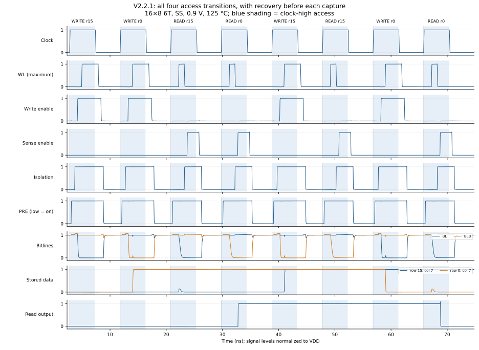

# V2.2.1: capture, access, and recovery in separate phases

**Completed functional screen. The assembled record is**
[`docs/data/PHASED_CONTROL_V2_2_1.json`](../data/PHASED_CONTROL_V2_2_1.json)**.
It is not yield, extracted-metal or half-select qualification.**

V2.2.1 captures the request on the rising clock edge, accesses the array during
clock-high, and releases and precharges it during clock-low. A longer period
pays for this separation. The 6T/10T cells, matched replica column, distributed
wires, and peripheral driver size classes are retained.

## Why the V2.1.10 boundary logic existed

The [V2.1.10 report](WRITE_LATCH_V2_1_10.md) correctly identifies the fundamental
problem: the rising edge captured the next address, write request, and data
while ending the previous write access. The physical wordline fell later.
Increasing the period without moving that boundary cannot remove this race;
the competing clock-to-Q and wordline-release paths still start at the same
edge.

V2.1.10 addressed it with address/request/data hold latches, a write slot, and
a delayed handover from the previous write's busy term to the next slot. Its
report records 340 passing cases, but these are functional screens with
illustrative wires, not yield qualification. One read sample required a larger
GMIN and therefore represents a perturbed circuit. The report also records why
simply holding every busy wordline was unsafe at read-to-write transitions.
Those results support the old architecture; they do not qualify this change.

The new schedule removes the reason for a cross-cycle handover. Each access
finishes and restores the array before any next-cycle register can change.
The registered signals remain stable through both access and recovery.

## The replica still times reads, not writes

`replica_column.py` implements a fixed stored zero. Its RBL/RBLB wires have the
array's row count and tapped geometry; only the last K cells are active, and
the replica wordline carries the matched row load. This is a reference for
read discharge and physical wordline release. It does not measure completion
of a real cell's state reversal. The replica's write driver also drives RBL
low in write cycles, so `rbl_delay` cannot safely terminate a write.

Read completion remains replica-timed. A write has the conservative clock-high
window; it ends at the falling edge. No new replica write-completion timer is
introduced.

## Signal order and implementation

Let `A` be `cs & clk_buf`, admitted by the existing far-PRE release guard, and
`B` be `wordline_busy = !(wl_en_bar & wordline_off)`. `wordline_off` observes
the far replica wordline and includes the existing settling stages.

```text
read_done      = rbl_delay & A & !we
write_prepare  = we & A
sa_iso         = read_done | write_prepare | !enables_off
iso_ready      = settled-high observation of the far physical ISO terminal
local_off      = !(s_en | w_en)
far_off        = !(sen_far | wen_far)
enables_off    = local_off & settled-high(far_off)
write_window   = A | B
w_en           = we & write_window & iso_ready
write_ready    = !we | wen_far
wordline_start = A & write_ready
wordline_req   = A & delayed(RC-filtered(wordline_start))
wl_en          = buffered(wordline_req & !read_done)
s_en           = read_done & !B & iso_ready
PRE            = buffered(!(clk_bar & wordline_off & enables_off))
```

`PRE` is active low; `sa_iso` high disconnects the sense inputs. These equations
describe the gate topology, not ideal zero-delay replacements. The observers,
settling chains, output buffers, and physical terminal wiring are essential.
The wordline setup chain is eight stages, follows the far driver enable, and
includes its frozen wire-settling RC scale. Above 64 rows, its first two
stages each carry twice the full-height decoder wire capacitance. Both loaded
pull-down and pull-up transitions must complete before WL can assert. The
input RC allowance also includes the address-trunk and local decoder loads. Its output is masked with the raw
request, so preparation cannot prolong WL release past clock fall. Isolation
uses four stages and its own line-load RC scale. Enable release uses two stages
and the slower of the sense/write line-load scales. Both release scales include
a conservative allowance for the two local sense-control RC sections.

A read proceeds as follows: precharge releases; the address settles and WL
opens; replica discharge asserts `read_done`; ISO closes and WL releases;
`s_en` can assert only after both physical isolation and wordline release have
been observed. ISO stays high until the sense enable has released. This
separates wordline conduction from sense regeneration even within one cycle.

A write proceeds as follows: precharge releases; `write_prepare` closes ISO;
the observed isolation permits `w_en`; the far write-enable terminal then
starts the wordline setup interval, including its remaining rise to full drive. WL opens with stable registered data and fully enabled drivers. At
clock fall WL releases, but `B` keeps the drivers on through its physical tail.
Once the far enables are observed off and settled, low-phase precharge restores
both bitlines, including
after consecutive writes. ISO remains asserted while either enable is active.

The intended write-driver/WL overlap and sense-enable/output-latch overlap are
required circuit operations. The prohibited overlaps are PRE with an active
WL/driver/sense footer, write enable with sense enable, read WL with sense
enable, and driver/sense enable before input isolation is established.

All four operation transitions now pass through the same recovered state:
WL, write enable, sense enable, ISO, and the replica trigger are low; bitlines
are high and PRE is asserted. The next operation therefore does not need the
previous operation's request or data. This statement depends on completing
recovery before capture, which is checked explicitly, rather than assuming
that a low logical `wl_en` means every physical wordline is already off.

| Consecutive operations | Required boundary ordering |
|---|---|
| Read → read | The first WL releases before sensing; SEN and ISO release, and BL/RBL restore before the next capture and read. |
| Write → read | The old WL releases before the write drivers; driver release and bitline restore precede the next read WL and sensing. |
| Read → write | The old SEN releases and isolation resets before capture; the new write establishes isolation and full driver enable before opening WL. |
| Write → write | The old WL and drivers both release and the bitlines restore before capture changes address/data; the next write repeats preparation. |

The following completed 16x8 6T nominal SS trace changes rows and column data
and exercises all four transitions. It is one passing case, not the outcome
of the entire pending screen. Enable, ISO and PRE traces are physical terminals
at the last column; WL is the maximum over all probed row endpoints.



The remaining feedback has a forced release path: clock fall makes `A=0`,
which forces the WL request and `read_done` low; physical WL release clears
`B`, then write/sense enables clear, then ISO releases and precharge starts.
There is no independently armed slot latch or handover into the next cycle.

## Removed logic and retained interfaces

Removed: the secondary address latches, held write-request latch, per-column
write-data latches and their enable wire, `din_hold`, `cs_pre`/select delay,
`write_slot`/selected slot, `BUSY_WRITE_NAND`, and `BUSY_HOLD_DELAY`. One buffer
per column replaces its data latch. The capture DFFs remain.

The controller's optional historical `din_hold_load` Python argument is
accepted but has no hardware effect. The generated subcircuit replaces the
obsolete `din_hold` pin with three appended feedback inputs: `iso_far`,
`sen_far`, and `wen_far`. They observe the replica sense-amplifier ISO/EN
terminals and the replica write-driver EN terminal, past the real columns. Direct SPICE instantiations
must use the new port list. Diagnostic complementary outputs remain available.

Instantiated MOS counts, using the same V2.1.10 peripheral loads and 6T/no-mux
settings with local RC, are:

| Array | V2.1.10 TIME_CONTROL | V2.2.1 TIME_CONTROL | Removed from controller |
|---|---:|---:|---:|
| 8x4 | 706 | 706 | 0 |
| 16x16 | 1030 | 1012 | 18 |
| 512x4 | 1014 | 906 | 108 |
| 8x512 | 11906 | 11902 | 4 |

The column data latches are outside TIME_CONTROL: each removed latch has 22
MOS and its replacement buffer has four in these configurations. Including
them and their shared enable inverter, the 16x16 control/data path falls from
1384 to 1076 MOS (308 fewer, about 22%). This is an instance count, not an extracted layout-area or
power claim. The remaining DFF bank dominates a wide controller's count. The new physical
feedback guards cost logic; the main simplification is eliminating secondary
storage and cross-cycle handover, not removing the safety observers.

## Clock contract and measurements

The `v2.2.0-timing-3` budgets are twice the V2.1.10 values through 64 rows
and three times the V2.1.10 values for the 128-, 256-, and 512-row classes.
The other exception is 512 columns, where the periods are 24 ns for 6T and 25.5 ns for muxed 6T
and 10T. Default periods
are 9 ns for small 6T, 9.5 ns for small 6T with a mux, and 10 ns for small 10T;
512-row periods are 27.75, 30, and 32.25 ns respectively. The next-bound selection,
geometric extrapolation, 25% margin, and 50 ps rounding policy remain. These
are conservative design settings, not a measured minimum frequency limit.

External address, select, write request, and data must meet the capture DFFs'
setup and hold requirements at the rising edge. The integration stimulus
changes them before capture; the phase change does not remove that interface
requirement.

For each configuration the clock-high budget must cover capture/decode,
precharge release, preparation, and read sensing or write completion. Clock-low
must cover WL release, driver/sense release, precharge and replica reset, with
margin before the earliest next register update. A longer high phase alone
cannot compensate for insufficient low-phase recovery.

The stimulus starts its rising transition at `1 ns + (k + 0.2) T`. Runtime data is
checked at `k + 0.7`, retained through `k + 1.2`, and restoration checked at
`k + 1.1`. The independent waveform checker requires correct data by
`k + 0.68`, reserving another 0.02 T before the runtime deadline. Waveform checks additionally cover pulse counts, physical terminal
thresholds, every probed cell's state, and the next capture boundary. The
finite rise/fall times and buffer delays must be included when assessing
margins; the nominal 50% plateau is not an ideal square-wave assumption.

`TCLK_WLEN` now starts at the rising edge. `TRESTORE` starts at the falling edge
for both reads and writes; `TWSLOT` remains a write-rail diagnostic within the
high access phase. `TPRCH` measures a post-access restore rather than borrowing
the startup charge crossing. Power integrates one complete capture-to-capture
period; static power is sampled late in recovery. Historical `TimingConfig`
JSON names `low_read`, `low_write`, and `high` are retained for compatibility;
they represent read access, write access, and recovery respectively in V2.2.1.

A control-architecture identity is included in sizing fingerprints. Reusing a
V2.1.10 frozen sizing object is rejected; old qualification records are not
promoted or silently reused.

The controller's direct-construction API also forwards custom local RC values
to its existing AND2 stubs. Previously those gates silently used the defaults.
This correction leaves 60 checked default controller netlists byte-identical;
the macro builder's existing policy keeps local RC inside TIME_CONTROL disabled.
Custom RC access timing still needs separate waveform qualification.

## Development findings

The first phased prototype let WL rise before the drivers had finished their
isolation wait. Starting setup from write enable fixed the small-array case.
A distributed-wire probe then showed why the physical far enable is needed:
at 8x128, FF 1.1 V / -40 C with 16x wordline/control-wire resistance, the far
driver enable was only 0.441 V while its local WL was active (required 0.99 V).
Setup now observes that terminal and includes a geometry-derived RC delay.

Likewise, the root enable output is insufficient for release. An 8x256 SS
trace left only 20.55 ps between far WEN reaching 0.1 VDD and far PRE falling
below 0.9 VDD. Recovery now observes both far enables and their settling,
and isolation uses its own load-derived settling scale.

The initial 8x512 6T nominal SS read at 16 ns missed its output deadline.
All 512 sense pairs resolved before the actual falling clock edge, but OUT
reached its required rail 103 ps after the stricter `k + 0.68` checker
deadline, although it met the runtime `k + 0.7` check. Independent
continuous checks found no forbidden overlaps in that trace. The entire
512-column class is therefore being rerun at the fixed longer periods above;
all shorter-clock wide attempts, including their passing write cases, are
excluded from release evidence. Increasing the clock does not itself enlarge
the local release guards: the initial trace had only 31 ps between physical
SEN release and PRE activation, so waveform ordering remains a required check.

A later first-read test at 512 rows exposed a decoder-settlement race that
write-first mixed sequences had masked. At SS, 0.9 V / 125 C, WL_EN rose at
6.333 ns while upper decoder branches were still releasing. Rows 63, 127,
191, 255, 319, 383, and 447 produced full-rail WL pulses, 304–496 ps above
half supply; the last false WL fell below 0.1 VDD at 7.225 ns. Correct captured
addresses and a high selected DEC_WL did not prove that every other decode
branch was off. The first write's extra enable preparation had delayed WL by
780 ps, and subsequent reads reused the settled address.

The candidate correction loads the first two existing setup inverters for
arrays above 64 rows, where the third decoder level appears. At 512 rows each
added capacitor is 102.4 fF, twice the 51.2 fF full-height wire capacitance;
the existing dummy inputs approximate the default decoder gate fan-out.
The additional passive settling bound includes trunk and local wire/gate
loads. This adds two capacitors without adding MOS gates. It is a matched-load
timing approximation, not observation of actual decoder completion. Its unit
widths and 3 fF/group and 2.5 fF gate-load estimates describe the present
decoder; altered decoder widths/models or wiring require separate validation.

Isolated five-corner transistor probes support the candidate: the loaded
512-row chain asserts in 1.967 ns and releases in 1.740 ns at SS, compared
with 0.223/0.216 ns without added load. These probes are not SRAM qualification.
The taller clock classes are extended by another 50%. The full-macro checker
already requires access_settled to be low at every capture, so an inadequately
reset delay cannot silently bypass setup on the next cycle.

Every old result above 64 rows is excluded, including passing mixed cases.
The replacement matrix has 242 cases: all affected arrays run again, with
additional first reads and address changes at 64, 128, and 256 rows and four
128-row mismatch samples. Two additional wide-array SF read/write cases
check the skewed corner against the small nominal release gap. The 512-row
mixed patterns now start with a read,
change addresses, and exercise all four operation transitions. Candidate and
loader hashes identify the temporary controller substitution while unrelated
base sources remain frozen. The guarded full-macro runs are still pending.

The initial development harness accidentally omitted the constructor's corner
argument, so its case names said SS/SF/FF/FS but its model cards were TT. Those
runs are diagnostics and are excluded from release evidence. The tracked
runner passes corner and temperature explicitly, records the actual corner
and model hash, and has a five-corner nominal/per-device regression. Workers
also reject source changes during a campaign rather than attributing cached
imports to newer files.

Independent reviews found a 0.01 T hole before capture in the first waveform
checker. Electrical exclusions are now checked continuously over the entire
post-capture trace, and cycle windows meet at capture for pulse accounting.
A regression injects simultaneous WL, write, sense and precharge activity in
that former gap and verifies rejection.

Further checker reviews added complete output-grid validation and rejection
of negative interpolated ordering margins. Electrical exclusions also test
threshold-interval intersections on every linear waveform segment, so an
overlap between two individually safe samples fails. The recorded spacing is
5 ps; interpolation cannot detect an excursion absent from the recorded trace.
Grid validation permits timestamp jitter of at most 1% of that interval
(50 fs), while requiring the exact sample count and contiguous indices.
This accommodates observed Xyce timestamp offsets below 5 fs without allowing
a missing sample to disappear through index renumbering.

Write-data stability is checked on those same interpolated segments while
WL is active, including any final partial access. Completion checks use the
fully evaluated cycles; safety checks continue through the recorded end.
Regressions reject both data changing during the falling WL tail and a data
glitch during a ninth partial write. The strengthened scorer is developed
separately while the circuit sources remain frozen, then applied to every
completed trace with the initial result preserved. Simulation-source identities
and the final scorer identity are recorded separately.

Retention checks also preserve each cell's logical polarity throughout reads,
idle cycles, and unselected writes, including partial final cycles. A selected
write may change state during its physical WL window. Read disturb is allowed
while Q and QB remain on their correct sides of 0.5 VDD; the existing 0.1 VDD
rail-error limit still applies after completion. Every sense group's settled
data is checked through physical sense-enable release, not at one sample only.

## Validation and limits

All 242 matrix cases have a complete trace and pass the tracked checker:
1,767,615 checks, no failures, no missing or superseded case. The assembler
refuses to write a screen that is incomplete, failing, scored by a different
checker, or built from sources that do not match the evidence. Intermediate,
failed and superseded attempts remain under ignored
`outputs/validation/V2.2.0-phased/`.

The worst margin of each ordering check over the whole screen is:

| Margin | Worst | Case |
|---|---:|---|
| Sense margin | 0.515 V | `512x4_10t_SS_read` / `_read_write` |
| Stored polarity | 0.260 V | `128x8_10t_mux_SS_read_changed_pd` |
| WL off before capture | 3817.8 ps | `16x8_6t_SS_mixed_rows_pd` |
| Driver on before WL | 184.1 ps | `2x2_6t_mux_FF_read_write` |
| Isolation before enable | 101.9 ps | `2x2_10t_mux_FF_write` |
| WL off before sense | 98.8 ps | `8x4_10t_mux_FF_read_pd` |
| Driver release after WL | 94.2 ps | `2x2_6t_mux_FF_read_write` |
| Enables off before precharge | 83.1 ps | `2x2_6t_FF_read_write` |

The four smallest are gate-delay limited in the observer chains at the fast
corner of the smallest arrays, not wire limited, so a longer clock does not
widen them. They are the quantities to watch if the observer chains or their
buffer sizes change.

Because the screen ran with a pinned controller overlay and explicit clocks,
the tracked sources are separately shown to regenerate every simulated deck:
242 of 242 decks are byte-identical after normalising only the output
directory in a model card's `.include`, with card contents compared separately
and every recorded numerical-retry change replayed and checked. That is what
ties the committed compiler, rather than a campaign-only overlay, to the
waveform evidence.

The software checks pass: 168 tracked tests, six optimizer tests, Python
compilation, and `git diff --check`. Of the tracked tests, 167 pass under the
system Python 3.11 here and one needs Xyce on `PATH`; all 168 pass in the
`openyield` Conda environment (Python 3.9.19, NumPy 1.26.4, PySpice 1.5). The
release screen reads text waveforms directly and uses full cells, so it does
not use PySpice's binary reader or equivalent extraction.

The 64 local development-tool tests also pass after adapting two timing
fixtures: current calibration requires post-write `TRESTORE`, while the
historical V2.1.9 slot test retains explicit historical phase budgets. These
local unit tests do not qualify the legacy waveform scorer for V2.2.1.

One completed small-array scenario needs a documented startup exception:
`8x4_10t_mux_FF_read_pd`, FF 1.1 V / −40 °C, native seed `202609263`.
Its original forced `.IC` bias failed DC convergence, including line search
and continuation attempts. Replacing all constraints with `.NODESET` converged
but changed stored bits; the waveform checker rejected that run.
The accepted retry retains every storage-node initial condition and the exact
device cards, seed, clock and circuit. It changes only the `.IC` values of
`BL0`–`BL3`, `RBL`, `SA_Q0`, and `SA_Q1` from 0 to 1.1 V, matching the
precharged peripheral state in clock-low, and uses `NONLIN SEARCHMETHOD=2`.
It passes the full waveform checks, including both consecutive reads and
continuous cell retention. No device-GMIN increase is used. This validates
access from that precharged startup state; the original forced-startup deck
remains an unconverged attempt, not passing evidence.

The precharged peripheral bias is the physical clock-low state, so making it
the default startup condition is the better long-term answer. It is not done
here: it changes every generated deck, and the screen those decks produced is
complete. Changing the default belongs with its own full re-run, so V2.2.1
keeps the single recorded exception above and carries the default change as
open scope.

All evidence uses full cells (equivalent mode 0), the supplied FreePDK45 models,
and illustrative distributed metal. Nominal cases explicitly request nominal
variation; local samples record their per-device seed and solver provenance.
The screen includes R→R, W→R, R→W, W→W, idle transitions, changed addresses,
complementary column patterns, class boundaries, and numerical failure status.
A passing software test or generated deck alone is not waveform evidence.

Extracted metal, half-selected writes, and yield estimation remain open.
Statistical screening cannot establish a zero failure probability. An untested
size, including a new combination of row and column classes, or a custom RC/PVT
point, or altered decoder sizing/models, needs its own waveform validation at a fixed baseline clock. The phase
change and longer clocks also change access
latency, energy, and static/dynamic power accounting; older performance numbers
must not be presented as measurements of V2.2.1.

## Review corrections and remaining scope

The screen ran against a frozen base tree plus a pinned controller overlay and
explicit clocks, so the corrected controller, timing table, case manifest and
checker lived outside the tracked sources while it ran. They are now the
tracked sources, and the deck reproduction above is what proves the promotion
was faithful rather than approximately right.

The release is numbered V2.2.1. Identities that the evidence hashes keep the
V2.2.0 label they were screened under, because renaming them would invalidate
the proofs that cite them: the clock table's `v2.2.0-timing-3` and its
`"version": "V2.2.0"`, the frozen sizing digest's `v2.2.0-high-access`, the
`"version": "V2.2.0"` recorded in all 242 traces, and the provenance comments
inside the screened sources. Two of those comments,
`sram_compiler/subcircuits/time_generate.py` line 12 and the clock table's
`basis`, cite this record under its pre-renumber name
`PHASED_CONTROL_V2_2_0.md`; correcting the path would change a hash that
`decoder-guard-netlist-equivalence.json` and
`final-clock-policy-equivalence.json` pin, so it waits for the next release
that re-runs them. `sram_compiler/version.py` is the one screened
source that moves; the compiler version never appears in a generated deck, and
the deck reproduction above was re-run against the moved value. The ignored
campaign directory keeps its `V2.2.0-phased` name.

Three corrections came out of reviewing that promotion:

- The checker reported whether the physical enables were off before precharge
  but not by how much. That gap is the one the superseded root-only observer
  reduced to 20.55 ps at 8x256 SS while every exclusion still passed, so a
  yes/no answer cannot show how close a passing screen came. It is now the
  reported `min_enable_off_before_precharge_ps`, and every trace was scored
  again with the checker that reports it.
- `_add_precharge_safety_measures` had stopped refusing a configuration
  without the replica guard. Without it `wordline_off` is `wl_en_bar`, a logic
  node, so the measurement would compare the precharge against a signal that
  cannot report the distributed wordline tail. It refuses again, and frozen
  driver sizes reject a missing replica guard as well as a missing
  precharge-off guard. Neither change can alter a deck, which the reproduction
  proof demonstrates rather than asserts.
- The startup bias decision above: the single recorded `.IC` exception stays,
  and changing the default is carried as open scope.

The 512-row decoder race is addressed by loading the first two setup-chain
stages above 64 rows. Its full-macro evidence passes the completed guarded
traces, including first-read, changed-address, read-after-read,
read-after-write, write-after-read and write-after-write checks. The load model
assumes the current unit decoder widths and default distributed wire geometry;
altered decoder sizing, custom geometry and unseen extrapolated arrays remain
outside this evidence. The guard is a matched-load approximation: it does not
observe decoder completion, and the reviews that examined it said so.

Both static reviews of the guard passed on circuit, policy, load rationale and
provenance, and neither asked for a circuit correction; both made acceptance
conditional on finishing the screen and assembling exact evidence. That
condition is now closed, and
`outputs/validation/V2.2.0-phased/decoder-guard-final-review.json` records the
closure with the evidence that closes it. It is not a new review verdict. An
independent review of the assembled record has not been performed, and
extracted metal, half-selected writes, yield estimation and the precharged
default startup bias remain open. This record therefore describes a completed
functional screen, not a qualification.
