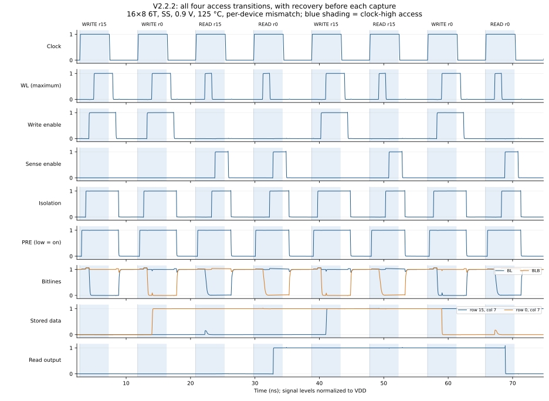

# V2.2.2: production review of the phased controller

**Completed functional screen. The assembled record is**
[`docs/data/PHASED_CONTROL_V2_2_2.json`](../data/PHASED_CONTROL_V2_2_2.json)**.
It is not yield, extracted-metal or half-select qualification.**

V2.2.2 is the production review of the V2.2.1 phased controller
([record](PHASED_CONTROL_V2_2_1.md)): every control gate and observer chain
was re-read against the four operation transitions and the idle boundaries,
the generated decks were re-examined, the waveform checker was extended to
report access and recovery margins, the startup bias that V2.2.1 carried as
open scope was fixed, and the whole screen was re-run from the tracked tree
with additional per-device mismatch cases at the larger arrays and the skewed
corners. The 6T/10T cells, the matched replica column, the distributed wires,
the driver size classes, the clock budgets and the TIME_CONTROL topology are
unchanged; no generated controller netlist differs from V2.2.1.

## What was reviewed and what was found

The controller was reviewed gate by gate in signal order
(`sram_compiler/subcircuits/time_generate.py`, whose module docstring now
carries the measured timing diagram and the causal chain of both operations).
The questions asked of each boundary were: can a delayed path prolong an
access past clock fall, can a stale term re-arm an enable in the next cycle,
and is every forbidden overlap excluded by an observed physical terminal
rather than by path length.

No functional defect was found in the controller. The cases examined, and
why each is safe, are recorded here so that a later change can be checked
against them:

- **Capture into an idle cycle.** When `cs` is captured low, the raw request
  `gated_clk_buf = cs & clk_buf` pulses for the flip-flop's clock-to-Q while
  the old `cs` is still high. The access request is `gated_clk_buf &
  pre_off_ready`, and `pre_off_ready` falls the moment the far precharge
  terminal turns on in the previous recovery, so the pulse cannot reach
  `write_prepare`, the setup chain or the write window. The screen's idle
  cases (`select_every: 2`) cover the access → idle → access boundary.
- **Idle clock-high.** PRE is `!(clk_bar & wordline_off & enables_off)`, so
  an idle clock-high phase leaves the bitlines floating at VDD with the sense
  pass gates open; they are precharged again in the following clock-low.
  The checker's restore and quiet-enable checks cover idle cycles.
- **Write → read and read → write captures.** `we` changes at clock-to-Q
  after capture. `w_en = we & (A | B) & iso_ready` cannot glitch because `A`
  waits for the far PRE release, `B` (the observed wordline) is low after a
  complete recovery and `iso_ready` is low once isolation has released;
  `read_done = rbl_delay & A & !we` is masked the same way, and the checker
  requires `A`, `B`, `iso_ready`, `access_settled`, `read_done` and
  `rbl_delay` low and `enables_off` high at every capture.
- **Read completion is latched by the discharged replica.** RBL cannot be
  precharged during clock-high, so `read_done` stays high until clock fall
  and the read wordline cannot re-arm within its own access. During a
  write the replica write driver discharges RBL too; `!we` masks the term.
- **Forced release.** Clock fall clears `A`, which clears `wordline_request`,
  `wl_en`, `read_done` and `write_prepare` through raw gates; every delayed
  path (setup chain, RC filters, observer chains) only delays assertion.
- **Write drivers cover the wordline tail.** `B = wl_en | !wordline_off` is
  already high through `wl_en` before `A` falls, so the window `A | B` has no
  gap at clock fall, and it closes only after the far replica wordline has
  been observed low and settled.
- **Nested observer subcircuits.** The precharge-off, isolation and
  enable-off guards reuse one Python class with different stage counts. In
  the generated deck each guard's delay chain is defined inside its own
  parent subcircuit (`PRECHARGE_OFF_GUARD`, `ISOLATION_OFF_GUARD`,
  `ENABLE_OFF_GUARD`), so the 2-stage enable chain and the 4-stage chains do
  not collide; this was checked on the generated 8x4 deck, not assumed.

Two production defects were found outside the controller logic:

- **Startup bias.** Generated decks forced every bitline, RBL and the sense
  nodes to 0 V at t = 0 while the controller, with the clock low, held PRE
  active and the sense pass gates open. That operating point does not exist
  in the circuit; Xyce 7.4 could not solve it for the per-device FF 1.1 V /
  −40 °C 10T mux read `8x4_10t_mux_FF_read_pd`, which V2.2.1 had to carry as
  a hand-patched exception. Every deck now starts from the precharged
  clock-low state (bitlines, RBL/RBLB and SA_Q/SA_QB at VDD); the output
  latch presets are unchanged. No measurement window moves, because every
  window already started at or after the first capture. The formerly failing
  case runs from the default deck in this screen.
- **Blind margins.** V2.2.1 reported only ordering margins. The 8x512 read
  that met the runtime `k + 0.7 T` check while OUT was still on the wrong
  rail at the checker's `k + 0.68 T` deadline was caught only because the
  checker failed it; a passing screen gave no number for how close reads
  came. The checker now reports `min_read_output_margin_ps` (the latched
  output and every sense group settled this long before the checker
  deadline; the sense nodes are only followed to the deadline because they
  are precharged again after isolation releases), `min_write_wl_after_flip_ps`
  (the earliest physical wordline endpoint leaves 0.1 VDD this long after the
  last written cell crossed mid-rail), `min_restore_before_capture_ps` (the
  last far bitline or RBL back above 0.9 VDD before the next capture) and
  `min_precharge_on_before_capture_ps`. All four are checked non-negative,
  and a read whose output settles after the deadline fails both the output
  check and the margin check.

Documentation drift was corrected: the controller source and the clock table
cited `PHASED_CONTROL_V2_2_0.md`, a record that never existed under that
name; both now cite this record, and the clock table's `version` is V2.2.2
with its `v2.2.0-timing-3` ladder unchanged.

## Timing diagram

The module docstring of `sram_compiler/subcircuits/time_generate.py` holds
the to-scale diagram of both operations, measured at 0.5 VDD on the 8x4 6T
array at SS, 0.9 V, 125 °C with a 9 ns clock, and the numbered causal chain
from capture through recovery. The order below is the contract; the spacing
is one array at one corner.

Write: capture → far PRE off (observed, settled) → access request →
isolation → far ISO observed → drivers on → far WEN observed → setup chain →
WL → clock fall clears WL → far replica WL observed off → drivers off → far
enables observed off → ISO release and PRE on → restore → next capture.

Read: capture → far PRE off → access request → setup chain → WL → replica
discharge → `read_done` isolates the sense inputs and clears WL → far replica
WL observed off and far ISO observed high → `s_en` → output latch → clock
fall clears `read_done` and `s_en` → far enables observed off → ISO release
and PRE on → restore → next capture.

The following completed 16x8 6T per-device trace at SS, 0.9 V, 125 °C from
this screen changes rows and column data and exercises all four transitions;
enable, ISO and PRE traces are physical terminals at the last column and WL
is the maximum over all probed row endpoints.

## Screen

The screen re-runs every V2.2.1 case from the tracked tree with the tracked
runner (`python3 -m tests.spice.phased_access`), without the controller
overlay and injected clocks that the V2.2.1 campaign needed, so each trace's
recorded source hashes equal the tracked tree and no deck-reproduction proof
is required. Twelve per-device read → write → read → write cases were added
where V2.2.1 had mismatch only at 16 rows or fewer and one 128-row read:
32x32 (SF, FS with a mux), 64x16 (FF with a mux, SS 10T), 128x8 (SF with a
mux), 256x4 (SS 6T, SS 10T with a mux), 8x128 (FS, SS 10T with a mux), 8x256
(SS with a mux), 512x4 and 8x512 (SS 6T). The 2 ns negative control is run
with the same checker and must fail.

All 254 cases have a complete trace and pass the tracked checker:
2,164,669 checks, no failure, no missing or duplicated case. The screen ran
72 per-device mismatch cases and 182 nominal cases over 12 array sizes at
SS (131 cases), SF (32), FF (49), FS (30) and TT (12), with 24 custom
mixed-row patterns, 8 idle patterns and 32 changed-address reads. The 2 ns
negative control fails 212 of its 1,442 checks under the same checker. No
case needed a numerical retry, and the formerly excepted
`8x4_10t_mux_FF_read_pd` converged from the default deck.

The worst value of every ordering and budget margin over the whole screen is:

| Margin | Worst | Case |
|---|---:|---|
| Sense margin | 0.467 V | `512x4_6t_SS_read_write_pd` |
| Stored polarity | 0.260 V | `128x8_10t_mux_SS_read_changed_pd` |
| WL off before capture | 3817.8 ps | `16x8_6t_SS_mixed_rows_pd` |
| Driver on before WL | 184.1 ps | `2x2_6t_mux_FF_read_write` |
| Isolation before enable | 102.0 ps | `2x2_10t_mux_FF_write` |
| WL off before sense | 98.8 ps | `8x4_10t_mux_FF_read_pd` |
| Driver release after WL | 94.1 ps | `2x2_6t_mux_FF_read_write` |
| Enables off before precharge | 83.2 ps | `2x2_10t_mux_FF_read_write` |
| Read output before the k + 0.68 T deadline | 1131.8 ps | `32x32_6t_SS_read_write` |
| WL dwell after the written cell flips | 2793.8 ps | `32x32_6t_SS_read_write` |
| Bitlines and RBL restored (0.9 VDD) before capture | 2678.6 ps | `32x32_6t_SS_read_write` |
| Precharge on before capture | 2896.6 ps | `32x32_6t_SS_read_write` |

The four smallest ordering margins remain gate-delay limited in the observer
chains at the fast corner of the smallest arrays, as in V2.2.1, and agree
with the V2.2.1 values to within a few picoseconds, which is the expected
effect of the changed startup bias on an access that begins several cycles
later. The tightest budget margins all fall on the nominal 32x32 6T SS
sequence, the upper bound of both the 32-row and the 32-column class at
9 ns: its read output leads the checker deadline by 1.13 ns, so that class
uses about 3.2 ns of its 4.3 ns access budget at SS 0.9 V / 125 °C, and its
precharge turns on 2.9 ns before the next capture. The per-device cases at
larger arrays keep more than 1.4 ns of read-output margin (the smallest is
the 32x32 6T SF sample). A change to the clock table, the observer chains
or the buffer sizes must be checked against these numbers.

Runtime: 174.5 solver-hours (641 core-hours) on Xyce 7.4, the longest case
being `8x512_10t_mux_SS_read_write` at 9.2 h on four ranks; Python 3.9.19,
NumPy 1.26.4, PySpice 1.5. The tracked test suites pass (170 tracked, 64
local development-tool tests, 6 optimizer tests), with `compileall` and
`git diff --check`.

## Limits

All evidence uses full cells (equivalent mode 0), the supplied FreePDK45
models and illustrative distributed metal (1 ohm / 0.1 fF per pitch).
Statistical screening cannot establish a zero failure probability; the
per-device cases are single seeded samples per configuration. An untested
size, a custom RC or PVT point, or altered decoder sizing needs its own
waveform validation at the frozen clocks. Extracted metal, half-selected
writes and yield estimation remain open (`docs/README.md`). The clock
contract assumes the 50 % duty cycle of the stimulus: a shorter high phase
shortens the access budget and a shorter low phase the recovery budget.
