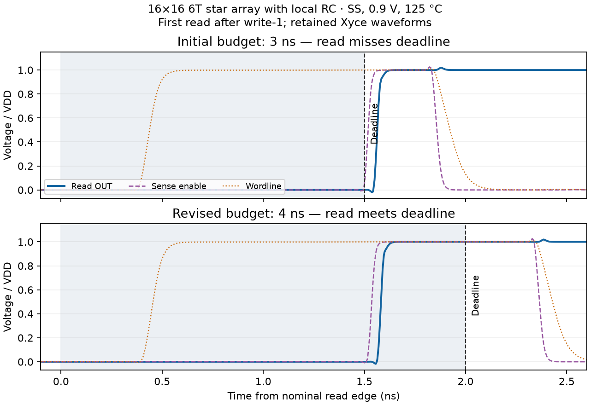

# V2.1.0: timing lookup and V2.0.11 review

Historical V2.1.0 evidence record. The distributed-only implementation and
subsequent retention/CLI repairs are released as **V2.1.1**; see the
[current report](DISTRIBUTED_ONLY_V2_1_1.md) and
[evaluation schedule](../../plans/V2_1_1_TIMING_FOLLOWUP.md). Measurements,
source identities and report-time queue states below keep their original
labels and do not describe current qualification.

Reviewed release: `0433072` (V2.0.11). The new clock policy is a fixed lookup,
following the driver-size class strategy requested for V2.1.0. This record is a
functional diagnostic, not full PVT or local-mismatch qualification. Historical
CSVs and qualification records are unchanged; `sizing_table.json` remains empty.

The [September 12 follow-up review](TIMING_LOOKUP_V2_1_0_FOLLOWUP.md) records
additional retention/CLI/scorer repairs, fresh write-waveform checks and the
resumable large-array schedule. Results below retain their original scope
and measurement identities.

## Timing policy

`sram_compiler/sizing/timing_lookup.json` stores integer half-cycle budgets in
picoseconds. Row bounds ≤32/64/128/256/512 contribute
1600/1800/2000/2400/3600 ps; column bounds ≤4/8/16/32/64/128/256/512 contribute
1600/1600/1600/1800/2000/2400/2800/3200 ps. Use the next bound at or above each
array dimension and select the larger budget:

```text
period = ceil_to_50ps(2 * max(row_budget, column_budget) * (1 + margin))
```

With the default 25% margin, 8x4 and 16x16 use 4 ns, 48x20 uses 4.5 ns,
64x64 uses 5 ns, and 512x4 uses 9 ns and 8x512 uses 8 ns. Unseen sizes beyond the table
continue the final geometric ladder and carry `extrapolated: true`.

Classes are shared across cell type, mux, RC and run PVT. They are design
settings, not measured worst-case phases. `ArrayTiming` binds a period to the
immutable driver baseline and timing options, including the table identity in
its metadata. Both testbenches apply it automatically. The optimizer freezes
it before modifying a candidate; yield testbenches retain it across samples.
Changed architecture, peripherals, PDK, physical context or timing options
cannot silently reuse an injected baseline. The resolver runs no simulation
and does not fit the historical timing model. Existing measured `TimingConfig`
and qualified-record formats remain unchanged.

Use `timing: {mode: fixed, t_period: 1.0e-8}` or CLI `--period 1e-8` for an
explicit diagnostic clock. `--timing-lookup` selects an alternative table.
The 50% duty cycle, 1% rise/fall times, 1 ns startup offset and replica K=1/N=9
are retained. The supplied timing proposal remains below its new implementation
note in `docs/TIMING_AUTOCONFIG.md`, with its original measurement labels.

The initial development table used a 1200 ps minimum budget (3 ns with margin).
The SS / 125 C / 0.9 V 16x16 sequence wrote and retained the cells but read OUT
after the deadline; the muxed distributed 10T sequence also missed its output
checks. These failed traces were retained. The minimum budget was increased to
1600 ps. At the revised 4 ns clock, the single 16x16 6T SS read measured
`TCLK_WLEN + TREAD_TOTAL = 1.524 ns` and restore 1.172 ns. This is a current
measurement, distinct from the V2.0.3 historical fits.

The distributed 512x4 SS read at 6.5 ns also missed its deadline: measured
clock-to-data was 3.341 ns, against a 3.25 ns half-cycle. Its final row-class
budget is 3600 ps (9 ns after margin). The failed 6.5 ns trace is retained.



## Corrections from the review

1. **Narrow star arrays could precharge before their RC wordline released.**
   Enable the existing four-stage settling guard on local-RC star arrays as
   well as distributed arrays. Emit and validate `VWL_PRE_FAR/LOCAL/PEAK_n`
   on all transient operations; the star LOCAL probe observes the cell's
   actual `WL_end`. The previous star check observed the driver node only.
   Explicit nonnegative even `sizing.precharge_guard_stages` values support
   separately validated wire configurations. A longer clock alone does not
   fix a wordline/precharge race, and unsafe settings still fail release checks.

2. **The distributed output latch bypassed the new sense-enable wire.**
   V2.0.11 connected sense amplifiers at their column taps but left the output
   latch on the near `S_EN` node. Connect the latch to the same mux-group column
   tap as its amplifier. Add near, first/last tap and far probes for all six
   distributed control lines, so their skew can be measured directly.

3. **Write-register initialization left feedback nodes unresolved.**
   Initialize the data DFF master/slave feedback nodes and the hold latch's
   internal NAND inputs consistently with the existing zero-data startup.
   This addresses the reported 8x32 distributed write operating-point failure.
   Initialization adds no transistor and changes no driver width.

4. **An access could finish after the frozen clock deadline.**
   Invalidate total read/write delays when the datum misses the deadline;
   Xyce 7.4 TRIG/TARG targets do not honor TO as an access deadline.
   `VACCESS_ERROR_n` checks Q/QB and read OUT at the deadline;
   `VHOLD_ERROR_n` checks retention; `VRESTORE_ERROR_n` checks the target
   bitlines and replica restored within 2% of VDD before the static-power
   window. Failed or missing checks invalidate the sample delay, preserving
   its index and raw measurements. The CLI rejects an incomplete ensemble.
   These targeted runtime checks supplement the independent waveform scorer;
   they do not prove every cell or every PVT condition.

5. **Short clocks made static power include startup charging.**
   Move PSTC to `1 ns + [1.6, 1.65] * T`, at the end of the first post-access
   restore. Extend the eight-cycle sequence to `1 ns + 8.7 * T` so its final
   restore and retention checks have a complete interval. The trace scorer
   separately checks bitline restoration before the next access.

6. **Timestep retries could discard evidence or resample a failed circuit.**
   Centralize the runtime retry in `utils/xyce.py`. One Newton line-search
   retry is allowed for a DC failure, and one 20 ps maximum-step retry for a
   timestep failure when no explicit maximum was supplied. Both preserve the
   original deck/log/outputs, pin the native sampling seed and remove stale
   solver outputs before retrying. Exit-zero numerical failures remain
   failures. Electrical misses never trigger a solver retry.

7. **Yield callers unpacked the old two-value API and counted NaN as success.**
   All 15 calls in AIS/ACS/MC/MNIS/HSCS now unpack four metrics; failure
   indicators include nonfinite values. Focused contract tests execute those
   assignments and indicators without requiring the legacy ML packages.
   This is not an end-to-end validation of those estimation algorithms.

8. **Run records could retain the old release label or lose a failed attempt.**
   CLI and Python metadata record V2.1.0, applied timing, PVT and model identity.
   CLI run identity includes timing; atomic attempt directories preserve repeated
   runs. Solver, access and plotting failures retain their summary before
   raising. Manual period changes update the timing metadata.

## Deck comparison and software checks

Generated 32 circuit decks from this tree and a detached V2.0.11 worktree:
8x8, 6T/10T, mux on, lookup/rules_only, star/distributed, local RC on/off,
read/write. Both trees used an explicit 10 ns clock to isolate circuit changes.
Sixteen circuit decks are byte-identical after normalizing only the checkout
path in `.include`; the remaining differences are the star-RC settling guard
and distributed read output-latch tap. The only changed field in the compared
driver vectors is `precharge_guard_stages`. The tracked transistor class table
and continuous driver-scale formulas are unchanged. Full simulation decks do
change because the timing, initialization and measurement cards change.

Software checks and exact waveform results are recorded in the adjacent
`TIMING_LOOKUP_V2_1_0.json` and the validation summary below. Reproduction:

```bash
python3 -m unittest discover -s tests -v
python3 -m unittest discover -s dev/tests -v
python3 -m unittest discover -s size_optimization/openyield_v2/tests -v
python3 -m compileall -q sram_compiler utils tests size_optimization/exp_utils.py yield_estimation/model_lib
git diff --check
python3 -m dev.validate_distributed_rc --xyce <Xyce> --cases <cases.json> --output outputs/validation/V2.1.0
```

The local waveform runner and development scripts are ignored, as in earlier
releases. Cases specify geometry, cell, mux, corner, voltage, temperature,
physical RC, period, solver ranks and seed. Full transistor arrays are used;
large-array storage probes sample unselected cells and include the selected
row. The scorer reads `.prn` crossings and independently checks data,
complement, read sense differential/output, retention, unselected wordlines
and cells, driven write bitlines, precharge exclusion and bitline restoration.

<!-- VALIDATION_SUMMARY -->
All **14 final-clock waveform cases pass**, including 8x4 star read/write/
sequence at TT, SS and SF; 16x16 6T SS sequence/read and SF write; muxed 16x16
10T distributed SS sequence; and the 512x4 distributed SS read at 9 ns.
The final release screen contains 2024 checks: 1996 independent trace checks
and 28 runtime measurement checks. Thirteen earlier
traces were also remeasured with the final access/hold/restore cards after
checking that their circuits, stimuli and analysis were identical; all pass.

| Screen | Attempts | Pass | Other outcomes |
|---|---:|---:|---|
| Initial timing budgets | 12 | 10 | Two serial wide-array timeouts |
| Extended geometry/corners | 13 | 7 | Three clock-budget misses, two large-array timeouts, one intentionally short-clock failure |
| Final clock periods | 14 | 14 | None |

The 8x32, 8x64 and 8x128 distributed writes converge and pass their waveform
checks. The two seeded 8x4 star per-device cases (SF write, seed 82026; SS read,
seed 82027) pass. The 30× wire stress passes with an explicit 12-stage guard.
The 64x64 TT sequence and 8x512 SS write reached their 1200-second diagnostic
limits; their partial artifacts are retained and provide no passing evidence.
They have not been relabeled as final-table verification.

At the final 512-row setting, clock-to-data is 3.348 ns, restore is 1.452 ns,
and peak wordline voltage during precharge is 6.94 mV at VDD=0.9 V; all 527
checks pass. This run used eight MPI ranks and explicit Newton line search.

The public Python API also completed 2x2 read, write, eight-cycle sequence and
hold-SNM operations with finite results (four returned transient metrics).
The CLI completed a nominal read and a two-sample per-device write, and
rejected a nominal read at an explicit 1 ns clock with
`access_checked: false` while preserving its summary and measurements.

Software verification: 95 tracked compiler tests pass on Python 3.11.7 and
3.9.19, 24 local development tests pass, and six offline optimizer tests pass.
Compilation and `git diff --check` pass. No repository type-checker/linter
configuration is provided, and `pyright`/`ruff` were not installed in this
workspace; no type/lint-suite pass is claimed.
<!-- END_VALIDATION_SUMMARY -->

## Direct control-wire measurements

Near-to-far skew measured from the `.prn` traces (ps). PRE uses the 90% falling
crossing; enables use the 50% rising crossing. These are actual wire delays,
not estimates inferred from data or release margins.

| Case | Clock (ns) | PRE | Write enable | WL enable | SA isolation |
|---|---:|---:|---:|---:|---:|
| 8x64 TT distributed write | 3.5 | 3.08 | 4.92 | 0.19 | 7.90 |
| 8x128 TT distributed write | 4.0 | 8.18 | 17.51 | 0.28 | 29.71 |
| 4x64 30× wire stress, 12-stage guard | 10.0 | 85.36 | 262.90 | 2.48 | 371.38 |
| 16x16 10T mux SS sequence | 4.0 | 0.24 | 0.32 | 0.45 | 0.31 |

The last sequence also measures 0.21 ps of near-to-far sense-enable skew.
The 8x64/8x128 measurements used the initial development clocks; their periods
are recorded explicitly and are not relabeled as final-table runs. The wire
stress passes with its explicit 12-stage setting; it does not qualify the
four-stage default for arbitrary metal.

## Limits

The tables are not a full PVT/mismatch or extracted-metal qualification. A few
seeded per-device diagnostics are not a yield estimate. Wire geometry in this
screen is illustrative (1 ohm / 0.1 fF per pitch, with explicit stress cases),
not foundry extraction. A fixed settling delay cannot cover arbitrary RC;
custom settings still require waveform checks. No failed or partial run is
promoted to `sizing_table.json`.

The compiler still writes all columns of the selected row; half-select column
qualification requires a separate architecture change. Legacy yield algorithms
retain their machine-local data paths and external ML dependencies; the
compiler return-contract repair does not establish their numerical validity.
